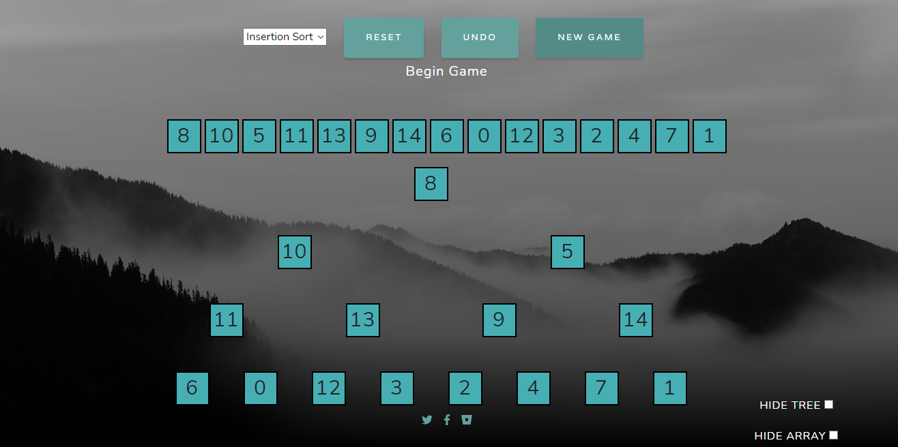
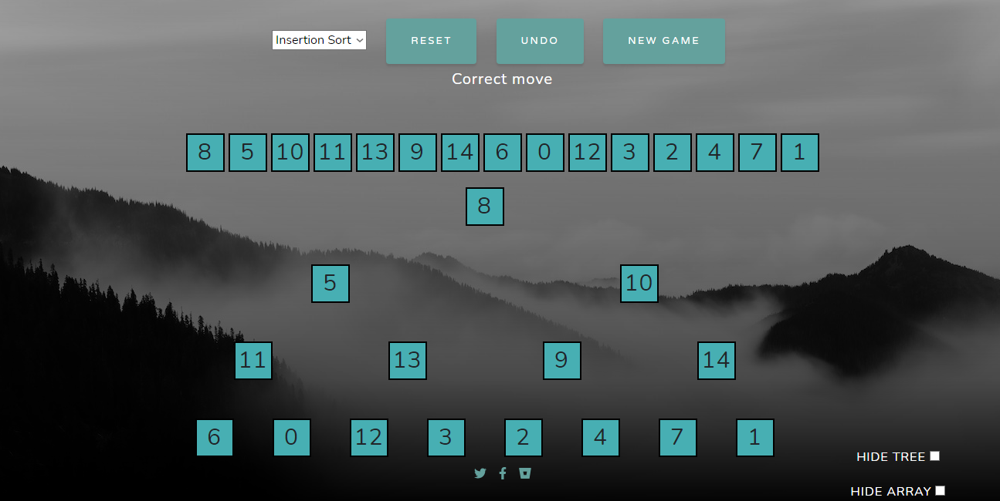

# README #

### What is this repository for? ###

* This is an interactive playground where users can learn sorting algorithms in visual manner
### How do I get set up? ###

* python version 3.0 or more
*  pip install flask 
* open and run  app.py
* open local host in your browser
*  or directly check website here [algorithm](https://petal-wood-mercury.glitch.me)

### How does it work ###

* choose any of the sorting algorithm given in the dropdown button
* press on new game 
 
* follow the algorithm and swap the elements in the same order as computer does it 
 
 

### Contribution guidelines ###
* Alan chang aca160@sfu.ca
* Akki singh asa297@sfu.ca
* Seth Liu liuyadal@sfu.ca
* Yi Hui Chen cvincentc@hotmail.com
### Who do I talk to? ###

* Repo owner or admin
* Other community or team contact